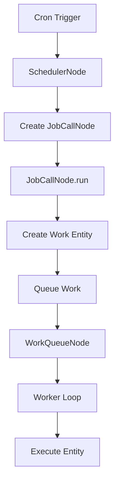

# FireFoundry Agent Bundle SDK Guide

## 1. Introduction to the Agent Bundle SDK

The Agent Bundle SDK (formerly AppRunner SDK) is the core framework of the FireFoundry platform, providing the foundation for building AI-powered applications. It introduces a unique architecture that separates structure from behavior, enabling sophisticated AI workflows while maintaining clear organization and extensibility.

### 1.1 Purpose and Role

The Agent Bundle SDK serves several critical functions in the FireFoundry ecosystem:

- **Application Framework**: Provides the structure for building AI applications
- **Entity Management**: Handles creation and relationships of business objects
- **Bot Orchestration**: Coordinates AI-powered behaviors through LLM interactions
- **Context Management**: Manages state and persistence across interactions
- **Workflow Orchestration**: Coordinates multi-step reasoning processes
- **Job Scheduling**: Manages background tasks and scheduled operations
- **Tool Integration**: Enables LLMs to interact with external systems

The SDK is designed to be extensible, allowing developers to create custom entities, bots, and prompts while maintaining a consistent architectural approach.

### 1.2 Core Concepts

The Agent Bundle SDK revolves around four primary concepts:

- **Entities**: Represent business objects, their relationships, and state in a persistent graph
- **Bots**: Implement AI-powered behaviors using structured LLM interactions
- **Prompts**: Define the structure and content of LLM requests
- **Tools**: Provide functions that LLMs can invoke during processing

These concepts are brought together in the **Entity-Bot Relationship** pattern, where runnable entities wrap bot functionality to create a cohesive system.

### 1.3 Architectural Philosophy

The Agent Bundle architecture is built on several key principles:

- **Separation of Concerns**: Structure (entities) is separated from behavior (bots)
- **Graph-Based Modeling**: Application state is represented as an entity graph
- **Resumable Computations**: Long-running workflows can be paused and resumed
- **Progressive Enhancement**: Start simple, add complexity as needed
- **Type Safety**: Leverage TypeScript for compile-time checking
- **Streaming First**: Real-time progress tracking throughout the stack

### 1.4 Links and Further Reading

## Getting Started
- **[Getting Started Guide](agent_sdk_getting_started.md)** - Step-by-step tutorial building a News Article Impact Analyzer to learn the core Entity-Bot-Prompt patterns.

## Core Concepts  
- **[Writing Bots](core/bots.md)** - Comprehensive guide to building AI-powered bots, including advanced error handling, tool calls, and direct execution patterns.
- **[Entity Modeling](core/entities.md)** - Complete guide to designing entity graphs, runnable entities, job scheduling, and graph traversal patterns.
- **[Prompting Framework](core/prompting.md)** - Deep dive into the structured prompting system, template nodes, working memory integration, and tool directives.

## Feature Guides
- **[Tool Calls](feature_guides/ad_hoc_tool_calls.md)** - Add external function calling capabilities to your bots for data lookup, calculations, and API integrations.
- **[File Upload Patterns](feature_guides/file-upload-patterns.md)** - Comprehensive guide to handling binary file uploads, storage, and retrieval using the Entity-Bot-Prompt pattern.
- **[Graph Traversal](feature_guides/graph_traversal.md)** - Navigate entity relationships and connections to build complex queries and workflows.
- **[Entity Graph Example](feature_guides/intermediate_entity_graph_example.md)** - Complete walkthrough building a job-resume matching system demonstrating advanced entity design patterns.
- **[Working with Files](feature_guides/uploading_files_example.md)** - Practical examples of storing and processing binary files using Working Memory and the Context Service.
- **[Vector Similarity](feature_guides/vector-similarity-quickstart.md)** - Add semantic search capabilities to your entities with pre-computed embeddings and similarity matching.
- **[Waitable Entities](feature_guides/waitable_guide.md)** - Build human-in-the-loop workflows that can pause execution and wait for external input indefinitely.

## 2. Entity System

The entity system provides a graph-based representation of application objects and their relationships.

### 2.1 Entity Architecture

Entities in Agent Bundle follow a hierarchical structure:

```typescript
DTOWrapper
    ├── EntityNode
    │   ├── EntityTreeNode
    │   ├── RunnableEntityClass
    │   │   ├── RunnableEntityBotWrapperClass
    │   │   └── WaitableRunnableEntityClass
    │   ├── SchedulerNode
    │   ├── JobCallNode
    │   └── WorkQueueNode
    └── EntityEdge
        ├── EntityEdgeContains
        ├── EntityEdgeCalls
        └── EntityEdgeOwns
```

Each entity has:
- **Unique ID**: GUID that identifies the entity
- **Type**: General and specific type identifiers
- **Data**: Application-specific properties
- **Relationships**: Connections to other entities via edges
- **Status**: For runnable entities (Pending, InProgress, Completed, Failed, Waiting)

### 2.2 Entity Relationships

Entities form a graph through relationships defined by edges:

```typescript
// Create a connection between entities
await parentEntity.appendConnection('Contains', ChildEntity, 'child_name', { 
    data: { /* additional edge data */ }
});

// Create or retrieve existing connection (idempotent)
await parentEntity.appendOrRetrieveConnection('Contains', ChildEntity, 'child_name', { 
    data: { /* additional edge data */ }
});
```

Common relationship patterns include:
- **Containment**: Parent-child relationships (e.g., Conversation contains Messages)
- **Calls**: Invocation relationships (e.g., Message calls Task)
- **Ownership**: Possession relationships (e.g., User owns Conversations)
- **TriggersRun**: Execution triggering (e.g., JobCall triggers RunnableEntity)

### 2.3 Entity Decorators

Agent Bundle uses TypeScript decorators to define entity metadata:

```typescript
@EntityDecorator({
    generalType: 'EntityMessage',
    specificType: 'EntityUserMessage',
    allowedConnections: {
        'Calls': ['EntityTask', 'EntityQuestion']
    }
})
class EntityUserMessage extends EntityNode<EntityNodeTypeHelper<...>> {
    // Implementation
}
```

### 2.4 Runnable Entities

Runnable entities are a cornerstone of the Agent Bundle SDK, representing resumable computations:

```typescript
@RunnableEntityDecorator({
    generalType: 'EntityStep',
    specificType: 'EntityStepAnalyzer',
    allowedConnections: {}
})
class EntityStepAnalyzer extends RunnableEntityClass<...> {
    protected async *run_impl(): RunnableEntityResponseIterator<...> {
        // Yield status updates
        yield await this.createStatusEnvelope('STARTED', 'Analysis started');
        
        // Perform work
        const result = yield* this.performAnalysis();
        
        // Yield completion
        yield await this.createStatusEnvelope('COMPLETED', 'Analysis completed');
        
        return result;
    }
}
```

Status progression for runnable entities:
- `Pending` → `InProgress` → `Completed` (successful execution)
- `Pending` → `InProgress` → `Failed` (execution error)
- `Pending` → `InProgress` → `Waiting` → `InProgress` → ... (waitable entities)

## 3. Bot System

The bot system implements AI-powered behaviors through structured interactions with LLMs.

### 3.1 Bot Architecture

Bots in Agent Bundle follow a consistent structure with robust error handling and retry capabilities:

```typescript
export default class AnalyzerBot extends Bot<ANALYZER_BTH> {
    constructor() {
        super({
            name: "AnalyzerBot",
            base_prompt_group: analyzer_prompt_group,
            model_pool_name: "azure_completion_4o",
            static_args: { company: "FinanceIQ" },
            max_tries: 3,
            dispatch_table: analyzerDispatchTable // Optional: for tool calls
        });
    }

    override async *postprocess_generator(
        broker_content: BrokerTextContent,
        request?: BotTryRequest<ANALYZER_BTH>
    ): BotPostprocessGenerator<ANALYZER_BTH> {
        // Process LLM response
        const json_code = extractJSON(broker_content.content);
        const result = AnalyzerOutputSchema.safeParse(JSON.parse(json_code));
        
        if (!result.success) {
            throw new FFError(`Invalid JSON structure: ${result.error.message}`);
        }
        
        return result.data;
    }
}
```

### 3.2 Try System and Error Handling

The try system enables sophisticated error handling with automatic retries:

- **Multiple Attempts**: Bots can retry up to `max_tries` times
- **Error Context**: Each try receives error information from previous attempts
- **Custom Error Handlers**: Specialized handlers for different error types
- **InternalError**: Automatic retries for temporary failures

```typescript
// Custom error handling for specific error types
export class CoderBot extends Bot<CODER_BTH> {
    constructor() {
        const errorHandlingFactory = new CoderErrorHandlingFactory();
        
        super({
            name: "CoderBot",
            base_prompt_group: coder_prompt_group,
            model_pool_name: "azure_completion_4o",
            thread_try_factory: (parent: Bot<CODER_BTH>) => 
                errorHandlingFactory.createErrorHandlingTryFactory(parent),
            max_tries: 5
        });
    }
}
```

### 3.3 Tool Calls and Dispatch Tables

Bots can invoke functions during processing through dispatch tables:

```typescript
const analyzerDispatchTable: DispatchTable<ANALYZER_PTH, ANALYZER_OUTPUT> = {
    execute_sql: {
        func: async (request, args: { query: string }) => {
            // Execute SQL query
            const results = await executeSQLQuery(args.query);
            return results;
        },
        spec: {
            name: "execute_sql",
            description: "Execute a SQL query",
            parameters: {
                type: "object",
                properties: {
                    query: { type: "string", description: "SQL query to execute" }
                },
                required: ["query"]
            }
        }
    }
};
```

### 3.4 Direct Execution

Bots can bypass the LLM and execute code directly when appropriate:

```typescript
export class CodeExecutionBot extends Bot<CODE_BTH> {
    constructor() {
        super({
            // ... other config
            direct_execution_handler: async function* (request) {
                return yield* this.handleDirectCodeExecution(request);
            }
        });
    }

    protected override should_use_direct_execution(request: BotRequest<CODE_BTH>): boolean {
        return !!request.args?.direct_code_reuse_path;
    }
}
```

## 4. Prompt System

The prompt system provides structured templates for LLM interactions.

### 4.1 Prompt Architecture

Prompts use a hierarchical template system:

```typescript
export class AnalyzerPrompt extends Prompt<ANALYZER_PTH> {
    constructor(args: ANALYZER_PTH['args']['static'], options?: ANALYZER_PTH['options']) {
        super('system', args, options);
        this.add_section(this.get_Context_Section());
        this.add_section(this.get_Rules_Section());
        this.add_section(this.get_Schema_Section());
        this.add_section(this.get_Examples_Section());
    }

    get_Context_Section(): PromptTemplateNode<ANALYZER_PTH> {
        return new PromptTemplateSectionNode<ANALYZER_PTH>({
            semantic_type: 'context',
            content: 'Context:',
            children: [
                `You are an AI analyst for ${this.static_args.company}.`,
                `Your task is to analyze data and provide insights.`
            ]
        });
    }
}
```

### 4.2 Prompt Groups

Complex interactions use prompt groups:

```typescript
const analyzer_prompt_group = new PromptGroup<ANALYZER_PTH>([
    {
        name: 'system_instructions',
        prompt: new AnalyzerPrompt(static_args)
    },
    {
        name: 'user_input',
        prompt: new PromptInputText<ANALYZER_PTH>({})
    }
]);
```

### 4.3 Working Memory Integration

Prompts can include content from working memory:

```typescript
const prompt_group = new WMPromptGroup<DATA_PTH>(
    [/* prompts */],
    {
        filterPaths: (paths: string[]) => 
            paths.filter(path => path.endsWith('.json')),
        getDescription: (path: string) => 
            `Content from ${path.split('/').pop()}:`
    }
);
```

## 5. Entity-Bot Relationship

The most distinctive pattern in Agent Bundle is the separation of entities (structure/state) from bots (behavior/AI), connected through runnable entities.

### 5.1 The Pattern

```typescript
@RunnableEntityBotWrapperDecorator({
    generalType: 'EntityStep',
    specificType: 'EntityStepAnalyzer',
    allowedConnections: {}
}, new AnalyzerBot())
class EntityStepAnalyzer extends AddInterface<...>(EntityStep<...>) {
    protected async get_bot_request_args(): Promise<BotRequestArgs<ANALYZER_BTH>> {
        const dto = await this.get_dto();
        
        // Build context from entity relationships
        const parentTask = await this.get_parent_task();
        const conversation = await this.get_conversation();
        
        return {
            id: `analyzer_${this.id}`,
            args: {
                coder_output: dto.data.coder_output,
                query: dto.data.query
            },
            input: dto.data.prompt,
            context: new Context(conversation, parentTask, dto),
            parent: undefined
        };
    }
}
```

### 5.2 Request and Response Flow

1. **Request Initiation**:
   - User action triggers runnable entity
   - Entity builds `BotRequest` from graph context
   - Request contains arguments, input, and context

2. **Bot Processing**:
   - Bot creates `BotTry` instances for attempts
   - Prompts are rendered and sent to LLM
   - Tool calls are executed if requested
   - Response is validated and processed

3. **State Management**:
   - Request maintains state throughout lifecycle
   - Errors preserved between tries
   - Partial results accumulated
   - Working memory updated

4. **Response Handling**:
   - Results returned to runnable entity
   - Entity state updated
   - Additional operations triggered
   - Results propagate through graph

### 5.3 Benefits of the Pattern

- **Separation of Concerns**: Clear division between structure and behavior
- **Persistence**: Entity system provides built-in persistence
- **Relationship Tracking**: AI operations connected in queryable graph
- **Debugging**: Clear visualization of reasoning steps
- **Extensibility**: New entities and bots added independently
- **Resumability**: Long-running workflows can pause and resume

## 6. Working Memory and Context

Working memory provides persistence for context and intermediate results during AI processing.

### 6.1 Working Memory Concepts

Working memory stores:
- Generated code and scripts
- JSON data and configurations
- Analysis results and reports
- Charts and visualizations
- Intermediate processing results

### 6.2 Memory Management

```typescript
// Store results in working memory
const wmp = request.parent.context_provider.working_memory_provider;
const { workingMemoryId } = await wmp.insert_code_memory({
    entityNodeId: task_node.id,
    name: 'analysis_results.json',
    memoryType: 'data/json',
    description: 'Analysis results',
    contentType: 'application/json',
    buffer: Buffer.from(JSON.stringify(results, null, 2)),
    metadata: {
        type: 'analysis_result',
        timestamp: new Date().toISOString()
    }
});
```

### 6.3 Memory Tidbits

Memory tidbits provide context persistence across interactions:

```typescript
const tidbitPrompt = new MemoryTidbitPrompt<MY_PTH>(
    'system',
    args,
    { preamble: 'Previous Context:' },
    ['fact', 'correction'], // Tidbit subtypes
    ['user_preference', 'domain_knowledge'] // Semantic purposes
);
```

## 7. Job Scheduling and Background Processing

The Agent Bundle SDK includes a comprehensive job scheduling system for background tasks.

### 7.1 Scheduler Architecture



### 7.2 Setting Up Scheduled Jobs

```typescript
@EntityDecorator({
    generalType: "Class",
    specificType: "SchedulerNode",
    allowedConnections: {
        'ScheduledCall': ['JobCallNode']
    }
})
export class DataRefreshScheduler extends SchedulerNode {
    constructor() {
        super();
        this.addJobDefinition({
            name: 'daily_data_refresh',
            cronExpression: '0 0 * * *', // Daily at midnight
            jobType: 'DataRefreshJob',
            jobData: { /* job configuration */ }
        });
    }
}
```

### 7.3 Work Queue Processing

```typescript
@EntityDecorator({
    generalType: "Class",
    specificType: "WorkQueueNode",
    allowedConnections: {
        'QueuedWork': ['RunnableEntity']
    }
})
export class BackgroundWorkQueue extends WorkQueueNode {
    constructor() {
        super();
        this.startWorkerLoop(); // Start processing queued work
    }
}
```

## 8. Tool Integration

Tools extend bot capabilities by allowing LLMs to interact with external systems.

### 8.1 Defining Tools

```typescript
const dataProcessingTools: DispatchTable<DATA_PTH, DATA_OUTPUT> = {
    fetch_data: {
        func: async (request, args: { source: string, filters: any }) => {
            // Fetch data from external source
            const data = await fetchFromAPI(args.source, args.filters);
            return data;
        },
        spec: {
            name: "fetch_data",
            description: "Fetch data from external API",
            parameters: {
                type: "object",
                properties: {
                    source: { 
                        type: "string", 
                        description: "Data source identifier" 
                    },
                    filters: { 
                        type: "object", 
                        description: "Filter criteria" 
                    }
                },
                required: ["source"]
            }
        }
    },
    save_results: {
        func: async (request, args: { name: string, data: any }) => {
            // Save results to working memory
            const wmp = request.parent.context_provider.working_memory_provider;
            const { workingMemoryId } = await wmp.insert_code_memory({
                entityNodeId: request.parent.context.prevailing_context_node_dto.id,
                name: `${args.name}.json`,
                memoryType: 'data/json',
                buffer: Buffer.from(JSON.stringify(args.data, null, 2))
            });
            return { saved: true, workingMemoryId };
        },
        spec: {
            name: "save_results",
            description: "Save results to working memory",
            parameters: {
                type: "object",
                properties: {
                    name: { type: "string" },
                    data: { type: "object" }
                },
                required: ["name", "data"]
            }
        }
    }
};
```

### 8.2 Tool Execution Flow

1. LLM requests tool call in response
2. Bot's dispatch table maps to function
3. Function executed asynchronously
4. Results added to conversation context
5. Processing continues with tool results

## 9. Agent Bundle Application Structure

Applications built with Agent Bundle follow a consistent structure.

### 9.1 Application Initialization

```typescript
export default class FinanceAnalyzerAgentBundle extends FFAgentBundle<FINANCE_ETH> {
    constructor() {
        super({
            id: "a0000000-0000-0000-0001-000000000000",
            name: "FinanceAnalyzerAgentBundle",
            description: "Financial Analysis Agent Bundle",
        }, FinanceConstructors);
    }

    override async first_time_deploy() {
        await super.first_time_deploy();
        
        // Initialize scheduler
        const scheduler = await this.factory.create_entity_node({
            specific_type_name: 'SchedulerNode',
            general_type_name: 'Class',
            data: { /* scheduler config */ }
        });
        
        // Initialize work queue
        const workQueue = await this.factory.create_entity_node({
            specific_type_name: 'WorkQueueNode',
            general_type_name: 'Class',
            data: { /* queue config */ }
        });
    }
}
```

### 9.2 Entity and Bot Registration

```typescript
const FinanceConstructors = {
    ...FFConstructors,
    // Entities
    'EntityConversation': EntityConversation,
    'EntityUserMessage': EntityUserMessage,
    'EntityAssistantMessage': EntityAssistantMessage,
    'EntityTask': EntityTask,
    'EntityStepKnowledgeLookup': EntityStepKnowledgeLookup,
    'EntityStepCoder': EntityStepCoder,
    'EntityStepAnalyzer': EntityStepAnalyzer,
    'EntityStepFactSheet': EntityStepFactSheet,
    // Edges
    'Contains': EntityEdgeContains,
    'Calls': EntityEdgeCalls,
    'InResponseTo': EntityEdgeInResponseTo,
    // Jobs
    'DataRefreshJob': DataRefreshJob,
    'ReportGenerationJob': ReportGenerationJob
} as const;
```

## 10. Building Complete Workflows

Agent Bundle excels at orchestrating complex, multi-step AI workflows.

### 10.1 Multi-Step Analysis Workflow

```typescript
export class AnalysisWorkflow {
    async execute(query: string, context: Context): Promise<AnalysisResult> {
        // Step 1: Knowledge Lookup
        const knowledgeLookup = await this.factory.create_entity_node({
            specific_type_name: 'EntityStepKnowledgeLookup',
            data: { query }
        });
        const knowledgeResult = await knowledgeLookup.run();
        
        // Step 2: Code Generation with error handling
        const coder = await this.factory.create_entity_node({
            specific_type_name: 'EntityStepCoder',
            data: { 
                query,
                knowledge_lookup_response: knowledgeResult,
                // Enable direct execution if code exists
                direct_code_reuse_path: await this.checkForExistingCode(query)
            }
        });
        const coderResult = await coder.run();
        
        // Step 3: Analysis
        const analyzer = await this.factory.create_entity_node({
            specific_type_name: 'EntityStepAnalyzer',
            data: { 
                query,
                coder_output: coderResult
            }
        });
        const analysisResult = await analyzer.run();
        
        // Step 4: Generate Fact Sheet
        const factSheet = await this.factory.create_entity_node({
            specific_type_name: 'EntityStepFactSheet',
            data: { query }
        });
        const factSheetResult = await factSheet.run();
        
        return {
            analysis: analysisResult,
            factSheet: factSheetResult,
            charts: coderResult.chart_array
        };
    }
}
```

### 10.2 Error Recovery Workflow

```typescript
export class RobustWorkflow {
    async executeWithRecovery(request: WorkflowRequest): Promise<WorkflowResult> {
        try {
            // Try primary execution path
            return await this.executePrimary(request);
        } catch (error) {
            if (error instanceof CompilerError) {
                // Use specialized error handler
                return await this.handleCompilerError(error, request);
            } else if (error instanceof InternalError) {
                // InternalError triggers automatic retries
                throw error; // Let the framework handle retries
            } else {
                // Fallback to simpler approach
                return await this.executeFallback(request);
            }
        }
    }
}
```

### 10.3 Progress Tracking

```typescript
public async *executeWithProgress(request: Request): AsyncGenerator<
    ProgressUpdate,
    Result,
    undefined
> {
    // Yield status updates throughout execution
    yield { type: 'STATUS', status: 'STARTED', message: 'Starting workflow' };
    
    // Step 1 with progress
    yield { type: 'STATUS', status: 'PROCESSING', message: 'Executing step 1' };
    const step1Result = yield* this.executeStep1(request);
    yield { type: 'PARTIAL_VALUE', content: { step: 1, result: step1Result } };
    
    // Step 2 with progress
    yield { type: 'STATUS', status: 'PROCESSING', message: 'Executing step 2' };
    const step2Result = yield* this.executeStep2(step1Result);
    yield { type: 'PARTIAL_VALUE', content: { step: 2, result: step2Result } };
    
    // Final result
    yield { type: 'STATUS', status: 'COMPLETED', message: 'Workflow completed' };
    return { step1: step1Result, step2: step2Result };
}
```

## 11. Extending Agent Bundle

Agent Bundle is designed to be extensible for custom applications.

### 11.1 Creating Custom Entities

```typescript
// 1. Define the DTO interface
export interface CustomAnalysisDTO extends EntityNodeDTO {
    data: {
        analysisType: string;
        parameters: Record<string, any>;
        results?: any;
    };
}

// 2. Create the entity class
@RunnableEntityBotWrapperDecorator({
    generalType: 'EntityAnalysis',
    specificType: 'CustomAnalysis',
    allowedConnections: {
        'Produces': ['AnalysisResult'],
        'Uses': ['DataSource']
    }
}, new CustomAnalysisBot())
export class CustomAnalysis extends RunnableEntityBotWrapperClass<...> {
    protected async get_bot_request_args(): Promise<BotRequestArgs<...>> {
        const dto = await this.get_dto();
        
        // Build context from entity graph
        const dataSources = await this.get_data_sources();
        
        return {
            id: `custom_analysis_${this.id}`,
            args: {
                analysisType: dto.data.analysisType,
                parameters: dto.data.parameters,
                dataSources
            },
            input: dto.data.query,
            context: await this.build_context()
        };
    }
}

// 3. Register in constructors
const AppConstructors = {
    ...FFConstructors,
    'CustomAnalysis': CustomAnalysis
} as const;
```

### 11.2 Creating Custom Bots

```typescript
// 1. Define schemas
export const CustomBotOutputSchema = withSchemaMetadata(
    z.object({
        summary: z.string(),
        insights: z.array(z.string()),
        recommendations: z.array(z.string()),
        confidence: z.number()
    }),
    'CUSTOM_BOT_OUTPUT',
    'Output from custom analysis bot'
);

// 2. Create prompt template
export class CustomBotPrompt extends Prompt<CUSTOM_PTH> {
    constructor(args: CUSTOM_PTH['args']['static']) {
        super('system', args);
        this.add_section(this.get_Context_Section());
        this.add_section(this.get_Analysis_Rules());
        this.add_section(this.get_Output_Schema());
    }
}

// 3. Implement bot
export class CustomAnalysisBot extends StructuredDataBot<
    typeof CustomBotOutputSchema,
    CUSTOM_BTH,
    CUSTOM_PTH
> {
    constructor() {
        super({
            name: "CustomAnalysisBot",
            schema: CustomBotOutputSchema,
            schema_description: "Structured analysis output",
            base_prompt_group: custom_prompt_group,
            model_pool_name: "azure_completion_4o",
            dispatch_table: customTools
        });
    }
}
```

### 11.3 Custom Tool Integration

```typescript
const customTools: DispatchTable<CUSTOM_PTH, CUSTOM_OUTPUT> = {
    analyze_trends: {
        func: async (request, args: { data: any[], metric: string }) => {
            // Custom analysis logic
            const trends = analyzeTrends(args.data, args.metric);
            
            // Store results
            const wmp = request.parent.context_provider.working_memory_provider;
            await wmp.insert_code_memory({
                name: 'trend_analysis.json',
                buffer: Buffer.from(JSON.stringify(trends))
            });
            
            return trends;
        },
        spec: {
            name: "analyze_trends",
            description: "Analyze trends in data",
            parameters: {
                type: "object",
                properties: {
                    data: { type: "array" },
                    metric: { type: "string" }
                },
                required: ["data", "metric"]
            }
        }
    }
};
```

## 12. Best Practices

### 12.1 Entity Design

- **Single Responsibility**: Each entity should have one clear purpose
- **Appropriate Granularity**: Balance between too many small entities and too few large ones
- **Clear Relationships**: Define allowed connections explicitly
- **Minimal Data**: Store only essential data in entities, use working memory for large content
- **Consistent Naming**: Follow patterns like `Entity[Type][Specific]`

### 12.2 Bot Implementation

- **Focused Tasks**: Design bots for specific, well-defined tasks
- **Structured Prompts**: Use the section pattern (Context, Rules, Schema, Examples)
- **Schema Validation**: Always validate outputs against schemas
- **Error Handling**: Implement appropriate error handling and retries
- **Tool Design**: Keep tool functions focused and well-documented

### 12.3 Prompt Engineering

- **Clear Context**: Provide clear role and task definition
- **Explicit Rules**: Define constraints and requirements
- **Schema Definition**: Include comprehensive output schemas
- **Good Examples**: Provide representative examples
- **Concise Language**: Keep prompts clear but complete

### 12.4 Workflow Design

- **Progress Visibility**: Use streaming for real-time updates
- **Error Recovery**: Plan for failures at each step
- **State Management**: Use entities to maintain workflow state
- **Idempotency**: Design operations to be safely retryable
- **Performance**: Use direct execution and caching where appropriate

### 12.5 Performance Optimization

- **Direct Execution**: Bypass LLM when code already exists
- **Broker Pool**: Leverage connection pooling for LLM calls
- **Working Memory**: Cache intermediate results
- **Batch Operations**: Group related operations when possible
- **Streaming Results**: Stream partial results for better UX

## 13. Common Patterns

### 13.1 Question-Answer Pattern

```typescript
// User asks a question
const userMessage = await factory.create_entity_node({
    specific_type_name: 'EntityUserMessage',
    data: { content: userQuery }
});

// Create task to process question
const task = await factory.create_entity_node({
    specific_type_name: 'EntityTask',
    data: { query: userQuery }
});

// Connect message to task
await userMessage.appendConnection('Calls', task);

// Execute task (which runs multiple steps)
const result = await task.run();

// Create assistant response
const assistantMessage = await factory.create_entity_node({
    specific_type_name: 'EntityAssistantMessage',
    data: { content: result.response }
});

// Connect response to original message
await assistantMessage.appendConnection('InResponseTo', userMessage);
```

### 13.2 Data Processing Pipeline

```typescript
// Step 1: Data retrieval
const dataRetrieval = await factory.create_entity_node({
    specific_type_name: 'EntityStepDataRetrieval',
    data: { sources: dataSources }
});

// Step 2: Data transformation
const transformation = await factory.create_entity_node({
    specific_type_name: 'EntityStepTransformation',
    data: { 
        transformRules: rules,
        inputPath: dataRetrieval.outputPath 
    }
});

// Step 3: Analysis
const analysis = await factory.create_entity_node({
    specific_type_name: 'EntityStepAnalysis',
    data: { 
        dataPath: transformation.outputPath 
    }
});

// Execute pipeline
for (const step of [dataRetrieval, transformation, analysis]) {
    const result = await step.run();
    // Handle results
}
```

### 13.3 Interactive Workflow

```typescript
@WaitableRunnableEntityDecorator({
    generalType: 'EntityWorkflow',
    specificType: 'InteractiveWorkflow'
})
export class InteractiveWorkflow extends WaitableRunnableEntityClass<...> {
    protected async *run_impl(): RunnableEntityResponseIterator<...> {
        // Initial processing
        const initialResult = await this.processInitial();
        
        // Wait for user input
        yield await this.createWaitingEnvelope(
            'Please review the results and provide feedback',
            { initialResult }
        );
        
        // Process will pause here until message received
        const { message, data } = yield* this.message_handler();
        
        // Continue with user feedback
        const finalResult = await this.processFeedback(data);
        
        return finalResult;
    }
}
```

## 14. Debugging and Monitoring

### 14.1 Logging

```typescript
import { logger } from "@firebrandanalytics/shared-utils";

// Use detailed logging for debugging
logger.detail('[EntityStepAnalyzer] Starting analysis', { 
    entityId: this.id,
    query: request.input,
    context: request.context
});

// Log errors with context
logger.error('[EntityStepAnalyzer] Analysis failed', { 
    error,
    entityId: this.id,
    tryIndex: request.try_index
});
```

### 14.2 Entity Graph Inspection

```typescript
// Examine entity relationships
const entity = await factory.get_entity(entityId);
await entity.load();

console.log('Edges from:', entity.edges_from);
console.log('Edges to:', entity.edges_to);

// Traverse the graph
const parent = await entity.get_parent();
const children = await entity.get_children();
```

### 14.3 Progress Monitoring

```typescript
// Monitor execution progress
const iterator = entity.start();
while (true) {
    const result = await iterator.next();
    if (result.done) {
        console.log('Final result:', result.value);
        break;
    }
    
    // Log progress updates
    const update = result.value;
    if (update.type === 'STATUS') {
        console.log(`Status: ${update.status} - ${update.message}`);
    } else if (update.type === 'PARTIAL_VALUE') {
        console.log('Partial result:', update.content);
    }
}
```

## 15. Conclusion

The Agent Bundle SDK provides a powerful foundation for building AI-powered applications with FireFoundry. By separating entities (structure) from bots (behavior) and connecting them through runnable entities, it enables sophisticated AI workflows while maintaining clear organization and extensibility.

Key strengths of the Agent Bundle architecture:

1. **Graph-Based Modeling**: Application state as a queryable entity graph
2. **Resumable Computations**: Long-running workflows with automatic persistence
3. **Robust Error Handling**: Multiple retry strategies and custom error handlers
4. **Tool Integration**: LLMs can interact with external systems
5. **Real-Time Progress**: Streaming updates throughout the stack
6. **Job Scheduling**: Background processing and scheduled tasks
7. **Type Safety**: Comprehensive TypeScript support
8. **Extensibility**: Easy to add custom entities, bots, and tools

The combination of these features creates a cognitive architecture capable of complex reasoning, code generation and execution, and contextual awareness, while maintaining the structure and predictability needed for enterprise applications.

For more detailed information on specific components:
- See the [Entity Modeling Guide](entities.md) for deep dives on entities
- See the [Bot Development Guide](bots.md) for bot implementation details
- See the [Prompting Framework Guide](prompting.md) for prompt engineering

The Agent Bundle SDK continues to evolve, with ongoing improvements in areas like distributed execution, enhanced tool capabilities, and advanced workflow orchestration.