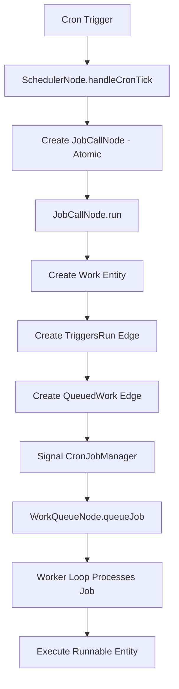

# Entity Modeling and Development with FireFoundry SDK

*Generated by Claude*

## 1. Introduction to Entity-Based Architecture

### 1.1 Core Concepts and Benefits

The FireFoundry SDK's entity framework provides a powerful approach to building AI-powered applications using an entity-based architecture. This architecture offers several key advantages:

- **Separation of Structure and Behavior**: Entities represent business objects and their structure, while bots implement AI-powered behaviors
- **Graph-Based Relationships**: Entities form a connected graph that represents complex business domains
- **Persistence and Queryability**: Entity relationships are persisted and queryable, making complex application state manageable
- **Extensibility**: New entity types can be added to extend application capabilities
- **Reusability**: Common patterns can be encapsulated in reusable entity types
- **Resumable Computations**: Entities can represent long-running, interruptible workflows

At its core, the entity framework revolves around several fundamental concepts:

1. **Entities**: Represent business objects, their relationships, and state
2. **Edges**: Connect entities to form a graph representing business domain relationships
3. **Types**: Define the structure and behavior of entities
4. **DTOs**: Pure data objects representing database records
5. **Runnable Entities**: Entities that encapsulate executable, resumable computations
6. **Agent Bundles**: Packaged AI behaviors that can be integrated with entities

### 1.2 Entity Framework Architecture

The entity framework follows a hierarchical structure:

```
DTOWrapper
    ├── EntityNode
    │   ├── EntityTreeNode
    │   ├── RunnableEntityClass
    │   │   ├── RunnableEntityBotWrapperClass
    │   │   └── WaitableRunnableEntityClass
    │   ├── SchedulerNode
    │   ├── JobCallNode
    │   ├── WorkQueueNode
    │   └── EntityUser
    └── EntityEdge
        ├── EntityEdgeContains
        ├── EntityEdgeCalls
        ├── EntityEdgeOwns
        ├── EntityEdgeDispatch
        ├── EntityEdgeInResponseTo
        ├── EntityEdgeScheduledCall
        ├── EntityEdgeQueuedWork
        └── EntityEdgeTriggersRun
```

### 1.3 The Entity-Bot Relationship Pattern

A key design pattern in FireFoundry is the separation of entities (structure/state) from bots (behavior/AI), connected through runnable entities:

- **Entities** maintain state and relationships in a persistent graph
- **Bots** implement AI-powered behaviors using LLMs
- **Runnable Entities** connect entities and bots, providing context from the entity graph to the bot
- **Agent Bundles** package related bots and entities for deployment

This separation allows for:
- Clear division of responsibilities
- Independent development of structure and behavior
- Flexible composition of complex capabilities
- Consistent patterns for AI integration

### 1.4 Entities as Computations

A fundamental perspective in FireFoundry is understanding entities not just as data containers, but also as **computational units**:

- **Runnable Entities**: Represent resumable computations with automatic state persistence
- **Waitable Entities**: Can pause execution waiting for external input
- **Entity Composition**: Complex workflows built by composing entity computations
- **Workflow Orchestration**: Entities coordinate multi-step AI processes

This computational perspective enables sophisticated AI workflows with automatic persistence, progress tracking, and error handling.

## 2. Core Entity Framework Components

### 2.1 DTOWrapper and EntityNode

The foundation of the entity framework is the relationship between DTOs (Data Transfer Objects) and entity classes using a **wrapper pattern**:

```typescript
export default class DTOWrapper<ETH extends EntityTypeHelper<any,any>, DTO extends SavedDTO<{id?:string}>> {
    protected readonly factory: EntityFactory<ETH>;
    protected readonly id: string;
    protected _dto?: DTO;
    protected _entityMetadata?: EntityMetadata;

    constructor(factory: EntityFactory<ETH>, idOrDto: UUID | DTO) {
        this.factory = factory;
        if (typeof idOrDto === 'string') {
            this.id = idOrDto;
        } else {
            this.id = idOrDto.id;
            this._dto = idOrDto;
        }
    }

    protected async load(): Promise<void> {
        throw new Error("Not implemented");
    }

    public async get_dto(): Promise<DTO> {
        if (!this._dto) {
            await this.load();
        }
        return this._dto!;
    }
}
```

`EntityNode` extends this foundation with relationship management:

```typescript
export default class EntityNode<ENH extends EntityNodeTypeHelper<any,any,any,any,any>> 
    extends DTOWrapper<ENH['eth'], ENH['dto']> {
    public edges_from: Partial<ArrayifyEdgeMap<ENH['eth'], ENH['edges_from']>>;
    public edges_to: Partial<ArrayifyEdgeMap<ENH['eth'], ENH['edges_to']>>;

    // Methods for connecting, updating, and managing relationships
    async connect_to(edge_dto: UnsavedEntityEdgeDTO): Promise<void>
    async update_data(newData: JSONObject): Promise<void>
    async update_data_path(path: string[], value: JSONValue): Promise<void>
    
    // Helper methods for creating connections
    protected async appendConnection<TTargetType>(...)
    protected async appendOrRetrieveConnection<TTargetType>(...)
}
```

### 2.2 EntityEdge

Relationships between entities are represented by the `EntityEdge` class:

```typescript
export default class EntityEdge<
    ETH extends EntityTypeHelper<any,any>, 
    FROM extends keyof ETH["constructors"], 
    TO extends keyof ETH["constructors"], 
    DTO extends EntityEdgeDTO
> extends DTOWrapper<ETH, DTO> {
    protected _from?: EntityPointer<ETH, FROM>;
    protected _to?: EntityPointer<ETH, TO>;

    async get_from(): Promise<InstanceType<ETH["constructors"][FROM]>>
    async get_to(): Promise<InstanceType<ETH["constructors"][TO]>>
}
```

### 2.3 EntityFactory and Type Revival

The `EntityFactory` implements the Factory Pattern and manages the revival of typed entities from database DTOs:

```typescript
export default class EntityFactory<ETH extends EntityTypeHelper<any,any>> {
    protected readonly constructors: ETH["constructors"];
    protected readonly entity_cache: { [K: UUID]: DTOWrapper<ETH, SavedDTO<JSONObject&{id?:UUID}>> };
    protected readonly pointer_cache: { [K: UUID]: EntityPointer<ETH, keyof ETH["constructors"]> };
    protected readonly entity_client: EntityClient;

    // Get entity with known type (synchronous, lazy-loaded)
    public get_entity_known_type<T extends keyof ETH["constructors"]>(
        entity_type: T, 
        id: UUID
    ): InstanceType<ETH["constructors"][T]>

    // Get entity with type determined from database
    public async get_entity<T extends keyof ETH["constructors"]>(
        id: UUID
    ): Promise<InstanceType<ETH["constructors"][T]>>

    // Create new entities
    public async create_entity_node<T>(node: UnsavedEntityNodeDTO): Promise<InstanceType<ETH["constructors"][T]>>
    public async create_or_retrieve_entity_node<T>(node: UnsavedEntityNodeDTO): Promise<InstanceType<ETH["constructors"][T]>>
    
    // Create edges with automatic position management
    public async create_entity_edge_with_incrementing_pos<T>(edge: UnsavedEntityEdgeDTO): Promise<InstanceType<ETH["constructors"][T]>>
}
```

### 2.4 EntityPointer

The `EntityPointer` class provides lazy loading references to entities:

```typescript
export default class EntityPointer<ETH extends EntityTypeHelper<any,any>, TNAME extends keyof ETH["constructors"]> {
    public readonly specific_type_name: TNAME;
    protected id: UUID;
    protected _val?: InstanceType<ETH["constructors"][TNAME]>;

    val(): Promise<InstanceType<ETH["constructors"][TNAME]>>
}
```

### 2.5 Decorators

The framework provides several decorators for entity metadata:

```typescript
// Basic entity decorator
@EntityDecorator({
    generalType: 'Class',
    specificType: 'User',
    allowedConnections: {
        'Owns': ['Conversation']
    }
})

// MetaClass decorator for meta-entities
@MetaClassDecorator({
    id: "f0000000-0000-0000-0000-000000000001",
    specificType: "Class"
})

// Runnable entity decorator
@RunnableEntityDecorator({
    generalType: 'Job',
    specificType: 'DataProcessor'
})

// Entity dispatcher decorator
@EntityDispatcherDecorator({
    "process_data": {
        entityClass: DataProcessor,
        entityType: "DataProcessor"
    }
})
```

## 3. Runnable Entities and Workflow Management

### 3.1 RunnableEntityClass

The base class for all executable entities:

```typescript
export default class RunnableEntityClass<ENH extends RunnableEntityTypeHelper<any,any,any,any,any>> 
    extends RunnableEntityBase<ENH> {
    
    // Main execution methods
    async run(): Promise<ENH['output']>
    async start(): Promise<RunnableEntityResponseIterator<...>>
    
    // Background execution
    runBackground(): void
    
    // Status management
    async get_status(): Promise<EntityNodeStatus>
    protected async update_node_status(status: EntityNodeStatus): Promise<void>
    
    // Core implementation method (override in subclasses)
    protected async *run_impl(): RunnableEntityResponseIterator<...>
    
    // Helper methods for workflow composition
    protected async appendCall<TTargetType>(...)
    protected async appendOrRetrieveCall<TTargetType>(...)
    protected async *doCall<TTargetType, TTargetResponse>(...)
}
```

Status progression for runnable entities:
- `Pending` → `InProgress` → `Completed` (successful execution)
- `Pending` → `InProgress` → `Failed` (execution error)
- `Pending` → `InProgress` → `Waiting` → `InProgress` → ... (waitable entities)

### 3.2 WaitableRunnableEntityClass

Extends runnable entities with the ability to wait for external input:

```typescript
export default class WaitableRunnableEntityClass<ENH extends RunnableEntityTypeHelper<any,any,any,any,{message: string; data: any}>> 
    extends RunnableEntityClass<ENH> {
    
    // Process external response
    async processResponse(message: string, data: any): Promise<ENH['output']>
    
    // Send message to waiting entity
    public sendMessage(message: string, data: any): void
    
    // Override to handle messages
    protected async *message_handler(message: string, data: any): RunnableEntityResponseGenerator<...>
    
    // Create waiting envelope for yielding
    protected async createWaitingEnvelope(message?: string, data?: any): Promise<RunnableEntityProgressWaitingEnvelope>
}
```

### 3.3 RunnableEntityBotWrapperClass

Integrates bots with runnable entities:

```typescript
export default class RunnableEntityBotWrapperClass<ENH extends RunnableEntityTypeHelper<any,any,any>> 
    extends RunnableEntityClass<ENH> {
    
    declare _bot: Bot<ENH['enh']['eth']['bth']>;
    
    // Override to provide bot context
    protected async get_bot_request_args(): Promise<BotRequestArgs<ENH['enh']['eth']['bth']>>
    
    // Automatically wraps bot execution
    protected override async *run_impl(): RunnableEntityResponseIterator<...>
}
```

### 3.4 Progress Tracking with AsyncLocalStorage

The framework uses `FFAsyncLocalStorage` to track execution context:

```typescript
// Breadcrumb tracking for nested entity calls
const breadcrumb = {
    entity_type: dto.specific_type_name!,
    entity_id: this.id!
};

const newBreadcrumbs = {
    breadcrumbs: [...existingBreadcrumbs.breadcrumbs, breadcrumb]
};

// Execute within context
await FFAsyncLocalStorage.run(newBreadcrumbs, async () => {
    // Entity execution with context tracking
});
```

## 4. Job Scheduling and Work Queue System

### 4.1 SchedulerNode

Manages scheduled job execution using cron expressions:

```typescript
@EntityDecorator({
    generalType: "Class",
    specificType: "SchedulerNode",
    allowedConnections: {
        'ScheduledCall': ['JobCallNode']
    }
})
export default class SchedulerNode extends EntityNode<SchedulerNodeTypeHelper> {
    private cronJobs: Map<string, CronJob> = new Map();
    private jobDefinitions: JobDefinition[] = [];
    
    // Lifecycle methods
    async initializeScheduler(): Promise<void>
    startScheduler(): void
    stopScheduler(): void
    
    // Handles cron triggers (atomic de-duplication)
    private async handleCronTick(jobDefinition: JobDefinition): Promise<void>
}
```

### 4.2 JobCallNode

Represents a scheduled job invocation:

```typescript
@RunnableEntityDecorator({
    generalType: "Class",
    specificType: "JobCallNode",
    allowedConnections: {
        'TriggersRun': ['RunnableEntity']
    }
})
class JobCallNode extends EntityNode<JobCallNodeBaseHelper> {
    protected async *run_impl(): RunnableEntityResponseIterator<any, { runnableWorkEntityId: string }> {
        // 1. Create work entity
        const createdRunnableDTO = await this.factory.create_entity_node(runnableWorkDTO);
        
        // 2. Create TriggersRun edge
        await this.factory.create_entity_edge_with_incrementing_pos(triggersRunEdgeDTO);
        
        // 3. Create QueuedWork edge
        await entity_client.create_edge_udf(queuedWorkEdgeDTO);
        
        // 4. Signal CronJobManager
        manager.signalJob(runnableWorkEntityId);
        
        return { runnableWorkEntityId };
    }
}
```

### 4.3 WorkQueueNode

Manages the work queue and worker loop:

```typescript
@EntityDecorator({
    generalType: "Class",
    specificType: "WorkQueueNode",
    allowedConnections: {
        'QueuedWork': ['RunnableEntity']
    }
})
export default class WorkQueueNode extends EntityNode<WorkQueueNodeTypeHelper> {
    private jobSignalBuffer: PushPullBufferObj<UUID>;
    
    // Queue management
    async initializeQueue(): Promise<void>
    public queueJob(runnableEntityId: UUID): void
    
    // Worker loop control
    startWorkerLoop(): void
    async stopWorkerLoop(): Promise<void>
    
    // Wait for next job (blocks until available)
    public async waitNextJobId(): Promise<UUID>
    
    // Internal worker loop
    private async _workerLoopInternal(): Promise<void>
}
```

### 4.4 Job Execution Flow



## 5. Advanced Entity Patterns

### 5.1 Entity Dispatcher Pattern

The dispatcher pattern enables dynamic method invocation:

```typescript
// Define dispatch functions
const dispatchFunctions: DispatchFunctionsMap<ETH> = {
    "process_data": {
        entityClass: DataProcessor,
        entityType: "DataProcessor"
    }
};

// Apply decorator
@EntityDispatcherDecorator(dispatchFunctions)
class MyEntity extends EntityNode<ENH> {
    // Entity can now dispatch to functions
}

// Usage
const result = await entity.run_dispatch<ProcessResult>('process_data', { data: inputData });
```

### 5.2 EntityTreeNode

For hierarchical entity structures:

```typescript
export default class EntityTreeNode<ENH extends EntityNodeTypeHelper<any,any,any,any,any>> 
    extends EntityNode<ENH> {
    
    protected _parent?: EntityTreeNode<ENH>;
    protected _children?: EntityTreeNode<ENH>[];
    
    async get_parent(): Promise<EntityTreeNode<ENH> | undefined>
    async get_children(): Promise<EntityTreeNode<ENH>[]>
    async has_children(): Promise<boolean>
    async is_root(): Promise<boolean>
}
```

### 5.3 Entity Connection Helpers

The framework provides several helper methods for creating and managing connections:

```typescript
// Create new connection
await entity.appendConnection('Contains', ChildEntity, 'child_name', { data });

// Create or retrieve existing connection (idempotent)
await entity.appendOrRetrieveConnection('Contains', ChildEntity, 'child_name', { data });

// Create edge with automatic position incrementing
await factory.create_entity_edge_with_incrementing_pos(edgeDTO);
```

## 6. Type System and Helpers

### 6.1 Type Helpers

The framework uses type helpers to ensure type safety:

```typescript
// Entity Type Helper (ETH)
type EntityTypeHelper<
    BTH extends BotTypeHelper<any,any,any,any,any,any>,
    CONSTRUCTORS extends DTOConstructors<SavedDTO<JSONObject & {id?: UUID}>>
> = {
    constructors: CONSTRUCTORS;
    bth: BTH;
};

// Entity Node Type Helper (ENH)
type EntityNodeTypeHelper<
    ETH extends EntityTypeHelper<any,any>,
    DTO extends EntityNodeDTO,
    T extends string,
    EDGES_FROM extends EdgeMap<ETH, T, any, any>,
    EDGES_TO extends EdgeMap<ETH, any, T, any>
> = {
    eth: ETH;
    dto: DTO;
    t: T;
    edges_from: EDGES_FROM;
    edges_to: EDGES_TO;
};

// Runnable Entity Type Helper (RETH)
type RunnableEntityTypeHelper<
    ENH extends EntityNodeTypeHelper<any,any,any,any,any>,
    OUTPUT,
    M = any,
    V = any,
    N = undefined
> = {
    enh: ENH;
    output: OUTPUT;
    metadata: M;
    value_type: V;
    next_type: N;
};
```

### 6.2 Constructor Registry

All entity constructors must be registered:

```typescript
const FFConstructors = {
    'Class': EntityNode,
    'Edge': EntityEdge,
    'User': EntityUser,
    'Contains': EntityEdgeContains,
    'Calls': EntityEdgeCalls,
    'InResponseTo': EntityEdgeInResponseTo,
    'Owns': EntityEdgeOwns,
    'Dispatch': EntityEdgeDispatch,
    'SchedulerNode': SchedulerNode,
    'JobCallNode': JobCallNode,
    'TriggersRun': EntityEdgeTriggersRun,
    'WorkQueueNode': WorkQueueNode,
    'ScheduledCall': EntityEdgeScheduledCall,
    'QueuedWork': EntityEdgeQueuedWork,
    'Job': EntityJob
} as const;
```

## 7. Best Practices and Guidelines

### 7.1 Entity Design Principles

1. **Single Responsibility**: Each entity should have a clear, focused purpose
2. **Composition over Inheritance**: Use mixins and decorators for behavior
3. **Lazy Loading**: Load data only when needed
4. **Immutable DTOs**: Never modify DTOs directly, use entity methods

### 7.2 Factory Management

```typescript
// Initialize factory with constructors
const factory = create_entity_factory(FFConstructors, app_id);

// Set as global factory
set_entity_factory(factory);

// Get entity with known type (lazy-loaded)
const user = factory.get_entity_known_type('User', userId);

// Get entity with type from database
const entity = await factory.get_entity(entityId);
```

### 7.3 DTO Management

```typescript
// ✅ Correct: Use entity methods
await entity.update_data({ property: 'value' });
await entity.update_data_path(['nested', 'property'], 'value');

// ❌ Wrong: Direct DTO modification
const dto = await entity.get_dto();
dto.data.property = 'value'; // This won't sync with database!
```

### 7.4 Error Handling in Runnable Entities

```typescript
protected async *run_impl(): RunnableEntityResponseIterator<...> {
    try {
        // Yield status updates
        yield await this.createStatusEnvelope('STARTED', 'Processing started');
        
        // Perform work
        const result = yield* this.doWork();
        
        // Yield completion
        yield await this.createStatusEnvelope('COMPLETED', 'Processing completed');
        
        return result;
    } catch (error) {
        // Yield error status
        yield {
            type: 'ERROR',
            entity_name: this.constructor.name,
            entity_type: (await this.get_dto()).specific_type_name!,
            entity_id: this.id!,
            error: error instanceof Error ? error : new Error(String(error))
        };
        throw new FFError(error as Error);
    }
}
```

### 7.5 Connection Management

```typescript
// Use typed connections
@EntityDecorator({
    generalType: 'Class',
    specificType: 'Container',
    allowedConnections: {
        'Contains': ['Item1', 'Item2'],
        'References': ['External']
    }
})

// Validate connections
const typeInfo = entity.constructor.prototype.getTypeInfo();
if (!typeInfo.allowedConnections[edgeType].includes(targetType)) {
    throw new Error(`Invalid connection: ${edgeType} to ${targetType}`);
}
```

## 8. Troubleshooting

### 8.1 Common Issues

1. **Entity Not Found**
   - Verify entity ID is correct
   - Check database connectivity
   - Ensure entity was created successfully

2. **Type Mismatch Errors**
   - Verify constructor registry includes all types
   - Check that specific_type_name matches registered constructor
   - Ensure type helpers are correctly defined

3. **DTO Sync Issues**
   - Never modify DTOs directly
   - Use entity update methods
   - Be aware of concurrent modifications

4. **Job Scheduling Issues**
   - Verify CronJobManager is initialized
   - Check job definitions are valid
   - Ensure WorkQueueNode is running

### 8.2 Debugging Tips

```typescript
// Enable detailed logging
import { logger } from "@firebrandanalytics/shared-utils";
logger.detail('[Component] Operation', { data });

// Examine entity relationships
await entity.load();
console.log('Edges from:', entity.edges_from);
console.log('Edges to:', entity.edges_to);

// Check entity metadata
const typeInfo = entity.constructor.prototype.getTypeInfo();
console.log('Type info:', typeInfo);

// Monitor job execution
logger.info(`Job ${jobId} status:`, await jobEntity.get_status());
```

## 9. Migration from Previous Versions

### 9.1 App Runner to Agent Bundle

All references to "App Runner" should be updated to "Agent Bundle":
- Update documentation and comments
- Rename variables and methods if applicable
- Update configuration files

### 9.2 New Features to Adopt

1. **Incremental Position Management**: Use `create_entity_edge_with_incrementing_pos` for edges
2. **Idempotent Entity Creation**: Use `create_or_retrieve_entity_node` where appropriate
3. **Waitable Entities**: Consider `WaitableRunnableEntityClass` for interactive workflows
4. **Status Event Emitters**: Subscribe to status changes for monitoring

## 10. Conclusion

The FireFoundry SDK entity framework provides a robust foundation for building sophisticated AI-powered applications with:

- **Graph-based domain modeling** through entities and edges
- **Resumable computations** via runnable entities
- **Job scheduling and queuing** for background processing
- **Type-safe operations** through the type helper system
- **Flexible composition** using decorators and mixins

Key takeaways:
1. Model your domain as an entity graph
2. Use runnable entities for workflows
3. Leverage the job scheduling system for background tasks
4. Always use entity methods for data updates
5. Follow the established patterns for consistency

For additional support, refer to the FireFoundry SDK examples and API documentation.